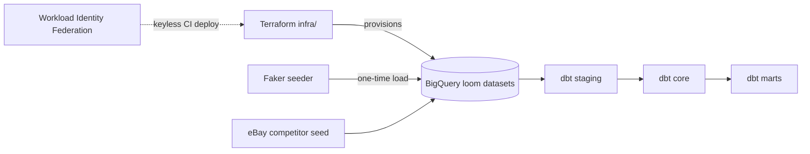

# Loom — Data Warehouse Pipeline

A portfolio data-engineering project: a synthetic e-commerce analytics warehouse for
**Loom** (a fictional online fashion retailer), built to be **run end-to-end by anyone** with
their own GCP project. Infrastructure-as-code provisions the platform, a standalone Faker
generator seeds realistic source data into BigQuery, and **dbt** builds a dimensional warehouse
across staging → core → marts.

Everything is driven by `.env` + `gcloud` OAuth2 (no service-account keyfiles): clone →
`terraform apply` → seed → `dbt build` → a populated, tested warehouse.

## Architecture



Auth is **OAuth2 / ADC** for humans and **Workload Identity Federation** for CI — no long-lived
keys. Datasets are **environment-prefixed** (`dev_`, `stg_`, prod bare) so dev/staging/prod
coexist in one project without collision.

> Full system + data-flow diagrams, the dbt layer lineage, and the warehouse layer catalog live in
> [`docs/architecture/overview.md`](docs/architecture/overview.md); the entity-relationship model
> (Mermaid + column-level DBML) is in [`docs/architecture/erd.md`](docs/architecture/erd.md).

## Run it yourself

**Prerequisites:** `gcloud`, `terraform` (≥1.9), `uv`, and a **GCP project you own**.

```bash
# 1 — Authenticate (OAuth2 / ADC, as the account that OWNS the project)
gcloud auth login
gcloud auth application-default login
gcloud config set project <your-project-id>
gcloud auth application-default set-quota-project <your-project-id>

# 2 — Configure
cp .env.example .env      # set GCP_PROJECT_ID / LOOM_PROJECT_ID to your project, dataset + bucket names

# 3 — Provision the data platform (BigQuery datasets, IAM, GCS, WIF, remote state)
cd infra/terraform/environments/dev
cp terraform.tfvars.example terraform.tfvars     # project id + globally-unique bucket names
terraform init && terraform apply
# (optional) move state to GCS: uncomment backend.tf, then
#   terraform init -migrate-state -backend-config="bucket=<your TF_STATE_BUCKET>"
cd ../../../..

# 4 — Seed synthetic source data into BigQuery (one-time; simulates real customer activity)
cd data_generation
set -a && source ../.env && set +a               # LOOM_PROJECT_ID, LOOM_SOURCE_DATASET=dev_loom_sync
uv run loom-datagen generate --scale small
uv run loom-datagen validate --scale small        # expect orphans:0, violations:[]
cd ..

# 5 — Build the warehouse (dbt ships in dbt-core; pin its runtime to Python 3.12)
uv tool install dbt-core --with dbt-bigquery --python 3.12
uv sync                                            # root tooling, incl. the invoke task runner
dbt deps --project-dir pipeline/dbt                # install dbt packages (dbt_utils, etc.) — one-time

# Recommended — the invoke task runner auto-loads .env (DBT_PROFILES_DIR/DBT_PROJECT_DIR → pipeline/dbt),
# so dbt resolves the project + profiles with no source/flags:
uv run invoke refresh                              # dbt seed + build, both --full-refresh (canonical green build)

# …or run dbt directly (equivalent):
set -a && source .env && set +a                    # GCP_PROJECT_ID, DBT_*_DATASET, BQ_LOCATION
dbt seed  --project-dir pipeline/dbt --profiles-dir pipeline/dbt
dbt build --project-dir pipeline/dbt --profiles-dir pipeline/dbt --exclude transformed_competitor_data
```

You now have a populated warehouse: the build finishes `ERROR=0` (the two `WARN`s are
intentional — real-world messy eBay competitor data). Explore the lineage with
`dbt docs generate --project-dir pipeline/dbt && dbt docs serve --project-dir pipeline/dbt`.

> **Task runner:** the repo ships an [`invoke`](https://www.pyinvoke.org/) task runner
> (`tasks.py`). `uv run invoke build` (models + tests), `seed`, `run`, `test`, `parse` (offline),
> `refresh` (seed + build, both `--full-refresh`), and `build-container` each auto-load `.env` so
> dbt needs no `source .env` or `--project-dir`/`--profiles-dir` flags. `uv run invoke --list`
> shows them all.

> The eBay competitor data is currently loaded as a dbt **seed** stand-in. The live eBay ETL
> (Airflow) is planned for **v0.4.0**, and the orchestration-runtime decision for **v0.5.0**.

## Repository layout

| Path | Purpose |
|------|---------|
| `infra/terraform/` | IaC — GCP data platform (datasets, IAM, GCS, WIF, remote state). Not containerised. |
| `data_generation/` | Standalone Faker generator (`loom-datagen`). Run **once**, post-Terraform. **Not** part of the pipeline. |
| `pipeline/dbt/` | The dbt warehouse (staging → core → marts) + seeds + OAuth profiles. |
| `pipeline/dags/`, `pipeline/etl/` | Airflow DAGs + eBay ETL (planned — **v0.4.0**). |
| `tasks.py` | `invoke` task runner — `build`/`seed`/`run`/`test`/`parse`/`refresh`/`build-container` (auto-loads `.env`). |
| `docs/` | System overview + diagrams, ERD, dbt build summary, business-metrics use-cases, release model. |
| `.github/workflows/` | CI matrix + WIF-gated production deploy. |

## Tech stack

Terraform · BigQuery · Workload Identity Federation · Python 3.13/3.14 + `uv` · Faker ·
dbt (BigQuery, Python 3.12) · `invoke` · Airflow · pytest · ruff · pre-commit · GitHub Actions.

## Development

```bash
uv sync                                   # root tooling (Python 3.13)
uvx ruff@0.14.2 check data_generation     # lint (matches CI + pre-commit)
cd data_generation && uv run pytest       # generator unit tests
pre-commit install                        # local quality gate (ruff, terraform fmt/validate)
uv run invoke --list                      # task runner — dbt/build shortcuts (see tasks.py)
```

Release & branch model (dev → staging → main, WIF deploys, tag-derived versioning) is
documented in [`docs/RELEASE.md`](docs/RELEASE.md). Warehouse build details are in
[`docs/architecture/dbt-build-summary.md`](docs/architecture/dbt-build-summary.md).
