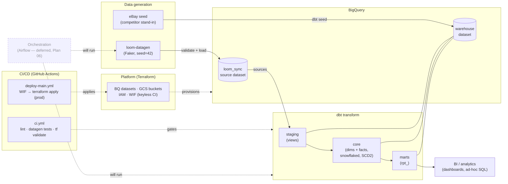
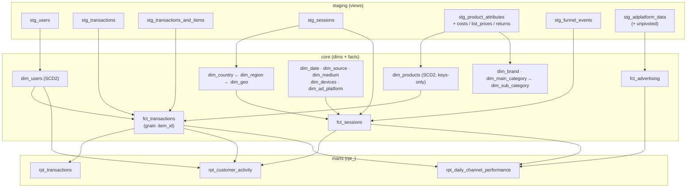

# System Overview & Data Flow

The Loom warehouse is a portfolio data platform: synthetic source data lands in BigQuery, dbt
transforms it through a layered dimensional model, and the `rpt_` marts serve analytics. All
infrastructure is Terraform-provisioned; CI/CD runs on GitHub Actions.

> Companion docs: [erd.md](erd.md) (entity-relationship model), [dbt-build-summary.md](dbt-build-summary.md)
> (validated build state), [RELEASE.md](../RELEASE.md) (branch/env + deployment model).

## System architecture

Datasets are environment-prefixed in a single GCP project — `dev_loom_sync`/`dev_warehouse`,
`stg_*`, and bare `loom_sync`/`warehouse` for prod (see [RELEASE.md](../RELEASE.md)).

## dbt lineage (layers)

## Warehouse layer catalog

Canonical model inventory (34 models + 1 seed). This is the catalog #24 referred to; the
per-layer summaries in [erd.md](erd.md) and [dbt-build-summary.md](dbt-build-summary.md) defer to
it.

| Layer | Materialization | Models |
|-------|-----------------|--------|
| **staging** | view | `stg_users`, `stg_transactions`, `stg_transactions_and_items`, `stg_sessions`, `stg_product_attributes`, `stg_product_costs`, `stg_product_list_prices`, `stg_product_returns`, `stg_funnel_events`, `stg_adplatform_data`, `stg_adplatform_data_unpivoted` (11) |
| **core — dims** | table | `dim_date`, `dim_users`, `dim_products`, `dim_brand`, `dim_main_category`, `dim_sub_category`, `dim_geo`, `dim_region`, `dim_country`, `dim_source`, `dim_medium`, `dim_devices`, `dim_ad_platform` (13) |
| **core — facts** | table | `fct_sessions`, `fct_transactions`, `fct_advertising` (3) |
| **core — intermediate** | ephemeral | `int_geo_locations` (1) |
| **marts** | table | `rpt_transactions`, `rpt_customer_activity`, `rpt_daily_channel_performance` (3) |
| **eBay stand-in** | table | `ebay_dim_brand`, `ebay_dim_category`, `ebay_fct_items` (3; from the `transformed_competitor_data` seed, retired by the eBay ETL — Plan 04 / v0.4.0) |

## Roadmap context

| Milestone | Theme |
|-----------|-------|
| **v0.2.0** | Conformed dimensional warehouse (this release) |
| **v0.3.0** | Fitness & data contracts (dbt-checkpoint/bouncer, pandera, project-evaluator) |
| **v0.4.0** | eBay ETL — runtime-agnostic package, swappable source |
| **v0.5.0** | Orchestration runtime — spike, ADR, provision + deploy |
